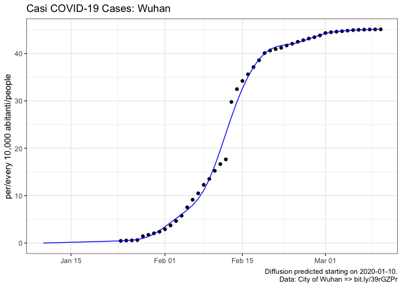

COVID-19: Comparison of per capita diffusion Wuhan - Italian provinces
================

``` r
library(dplyr)
```

    ## 
    ## Attaching package: 'dplyr'

    ## The following objects are masked from 'package:stats':
    ## 
    ##     filter, lag

    ## The following objects are masked from 'package:base':
    ## 
    ##     intersect, setdiff, setequal, union

``` r
library(ggplot2)
library(sf)
```

    ## Linking to GEOS 3.7.2, GDAL 2.4.2, PROJ 5.2.0

``` r
library(tidyr)
library(mgcv)
```

    ## Loading required package: nlme

    ## 
    ## Attaching package: 'nlme'

    ## The following object is masked from 'package:dplyr':
    ## 
    ##     collapse

    ## This is mgcv 1.8-26. For overview type 'help("mgcv-package")'.

``` r
library(plyr)
```

    ## -------------------------------------------------------------------------

    ## You have loaded plyr after dplyr - this is likely to cause problems.
    ## If you need functions from both plyr and dplyr, please load plyr first, then dplyr:
    ## library(plyr); library(dplyr)

    ## -------------------------------------------------------------------------

    ## 
    ## Attaching package: 'plyr'

    ## The following objects are masked from 'package:dplyr':
    ## 
    ##     arrange, count, desc, failwith, id, mutate, rename, summarise,
    ##     summarize

``` r
theme_set(theme_bw())
```

``` r
prov_ita.data <- 
  read.csv('https://raw.githubusercontent.com/pcm-dpc/COVID-19/master/dati-province/dpc-covid19-ita-province.csv',
           stringsAsFactors = F)
prov_ita.data$date <- 
  as.Date(prov_ita.data$data)

prov_ita.data$sigla_provincia[prov_ita.data$denominazione_provincia == "Napoli"] <- "NA"

prov_ita.sf <- 
  read_sf("data/ProvCM01012019_g/ProvCM01012019_g_WGS84.shp",
          stringsAsFactors = F)

pop_data_totale <- 
  read.csv("data/DCIS_POPRES1_05032020001037056.csv", stringsAsFactors = F) %>%
  dplyr::filter(grepl("IT([A-Z])?\\d{2,3}([A-Z])?|ITC4(A|B)|ITE1A", ITTER107) &
                  Stato.civile == "totale" &
                  ETA1 == "TOTAL" &
                  Sesso == "totale") %>%
  dplyr::mutate(Territorio = recode(Territorio,
                                    `Valle d'Aosta / Vallée d'Aoste` = "Aosta",
                                    `Bolzano / Bozen` = "Bolzano",
                                    `Forlì-Cesena` = "Forli'-Cesena",       
                                    `Massa-Carrara` = "Massa Carrara"))

pop_data_over65 <- 
  read.csv("data/DCIS_POPRES1_05032020001037056.csv", stringsAsFactors = F) %>%
  dplyr::filter(grepl("IT([A-Z])?\\d{2,3}([A-Z])?|ITC4(A|B)|ITE1A", ITTER107) &
                  Stato.civile == "totale" &
                  Sesso == "totale" &
                  !(ETA1 %in% c("TOTAL", "Y_GE100")) &
                  as.numeric(gsub("Y", "", ETA1)) > 64) %>%
  dplyr::mutate(Territorio = recode(Territorio,
                                    `Valle d'Aosta / Vallée d'Aoste` = "Aosta",
                                    `Bolzano / Bozen` = "Bolzano",
                                    `Forlì-Cesena` = "Forli'-Cesena",       
                                    `Massa-Carrara` = "Massa Carrara")) %>%
  dplyr::group_by(Territorio) %>%
  dplyr::summarize(Value = sum(Value))
```

    ## Warning: NAs introduced by coercion

``` r
prov_ita.sf$pop_2019 <- 
  pop_data_totale$Value[match(prov_ita.sf$DEN_UTS, pop_data_totale$Territorio)]
prov_ita.sf$over65_2019 <- 
  pop_data_over65$Value[match(prov_ita.sf$DEN_UTS, pop_data_over65$Territorio)]

# download.file("https://raw.githubusercontent.com/BlankerL/DXY-COVID-19-Data/master/csv/DXYArea.csv",
#               destfile = "data/DXYArea.csv")
dat_china <-
  read.csv("data/DXYArea.csv")

wuhan_pop <- 11081000

dat_wuhan <- 
  dat_china %>%
  dplyr::filter(cityEnglishName == "Wuhan") %>%
  dplyr::mutate(numero_casi = city_confirmedCount) %>%
  dplyr::group_by(date = as.Date(updateTime)) %>%
  dplyr::summarize(totale_casi = max(city_confirmedCount), 
                   perc = totale_casi / wuhan_pop * 10000)
```

``` r
prov_ita.last_data <- 
  prov_ita.data %>%
  dplyr::filter(!is.na(totale_casi) &
                  date == max(date))

prov_ita.sf$totale_casi <- 
  prov_ita.last_data$totale_casi[match(prov_ita.sf$SIGLA, 
                                  prov_ita.last_data$sigla_provincia)]

prov_ita.sf$lat <- 
  prov_ita.last_data$lat[match(prov_ita.sf$SIGLA, 
                                  prov_ita.last_data$sigla_provincia)]

prov_ita.sf$long <- 
  prov_ita.last_data$long[match(prov_ita.sf$SIGLA, 
                                  prov_ita.last_data$sigla_provincia)]

prov_ita.sf$perc <- prov_ita.sf$totale_casi / prov_ita.sf$pop_2019 * 10000

require(rmapshaper)
prov_ita_simp.sf <- 
  rmapshaper::ms_simplify(input = as(prov_ita.sf, 'Spatial'), keep = 0.05) %>%
  st_as_sf() %>%
  st_transform(4326)

start_time <- Sys.time()
ggplot(prov_ita_simp.sf) + geom_sf()
end_time <- Sys.time()
end_time - start_time

save(prov_ita_simp.sf, file = "prov_ita_simp.sf.RData")
```

``` r
getGam <- function(dat) {
  require(mgcv)
  dat <- dat[dat$totale_casi > 0,c("totale_casi", "date")]
  names(dat) <- c("y","date")
  dat$date <- as.Date(dat$date)
  dat <- dat[order(dat$date),]
  dat$x <- 1:nrow(dat)
  res <- 
    mgcv::gam(formula = y ~ s(x, bs = "cs"),  data = dat, method="REML")
}

getGamOrigin <- function(dat) {
  require(mgcv)
  res <- getGam(dat)
  pred <- predict(res, newdata = data.frame(x = -20:0))
  this_seq <- seq(min(dat$date)-20, min(dat$date), by = "day")
  return(this_seq[which(abs(pred-0)==min(abs(pred-0)))])
}
```

# Wuhan

## Predicted origin

``` r
wuhan_origin <- 
  getGamOrigin(dat_wuhan)
wuhan_origin
```

    ## [1] "2020-01-10"

## Fit

``` r
gam_res <- 
  getGam(dat_wuhan)
gam_pred <-
  predict(gam_res, newdata = data.frame(x = -as.numeric(min(dat_wuhan$date)-wuhan_origin):-1))
wuhan_curve.df <-
  rbind(data.frame(date = dat_wuhan$date,
                   fit = gam_res$fitted.values / wuhan_pop * 10000,
                   stringsAsFactors = F),
        data.frame(date = seq(wuhan_origin, min(dat_wuhan$date)-1, by = 'day'),
                   fit = gam_pred / wuhan_pop * 10000,
                   stringsAsFactors = F))
wuhan_curve.df <-
  wuhan_curve.df[order(wuhan_curve.df$date),]
```

``` r
ggplot() +
  geom_point(data = dat_wuhan, aes(x=date, y=perc)) +
  geom_line(data = wuhan_curve.df,
            aes(x=date, y=fit),
            colour = "blue") +
  labs(x = NULL, y = "per/every 10,000 abitanti/people",
       caption = sprintf("Diffusion predicted starting on %s.\nData: City of Wuhan => bit.ly/39rGZPr", wuhan_origin),
       title = paste0("Casi COVID-19 Cases: Wuhan"))
```

<!-- -->

# Italian provinces

``` r
prov_long.df <- data.frame(stringsAsFactors = F)

for (prov in prov_ita.sf$SIGLA) {
  
  this_dat <- 
    prov_ita.data %>%
    filter(sigla_provincia == prov) %>%
    mutate(perc = totale_casi / prov_ita.sf$pop_2019[prov_ita.sf$SIGLA == prov] * 10000)
  
  if (max(this_dat$totale_casi)==0) {
    next
  }
  
  this_origin <-  try({
    getGamOrigin(this_dat)
  })
  
  # Manual correction
  if (prov == "LO") {
    this_origin <- as.Date("2020-02-09")
  }
  if (prov == "CR") {
    this_origin <- as.Date("2020-02-14")
  }
  
  if(class(this_origin) == "try-error") {
    next
  }
  
  this_seq <- 
    seq(from = this_origin, 
        to = this_origin + (length(wuhan_curve.df$fit) - 1),
        by = 'day')
  
  this_dat <- 
    plyr::rbind.fill(this_dat, data.frame(date = this_seq[!this_seq %in% this_dat$date], 
                                          stringsAsFactors = F))
  
  this_dat <- 
    this_dat[order(this_dat$date),]
  
  this_dat$wuhan_curve <- wuhan_curve.df$fit
  
  this_dat$pred_date_origin <- this_origin
  
  this_dat <- 
    this_dat %>% 
    dplyr::select(date, perc, totale_casi, sigla_provincia, denominazione_provincia, denominazione_regione,
                  wuhan_curve, pred_date_origin) %>%
    dplyr::mutate(sigla_provincia = unique(sigla_provincia[!is.na(sigla_provincia)]),
                  denominazione_provincia = unique(denominazione_provincia[!is.na(denominazione_provincia)]),
                  denominazione_regione = unique(denominazione_regione[!is.na(denominazione_regione)]))
  
  prov_long.df <- 
    rbind(prov_long.df, this_dat)
  
}
```

``` r
save(prov_long.df, file = "prov_wt_fit.RData")
```
